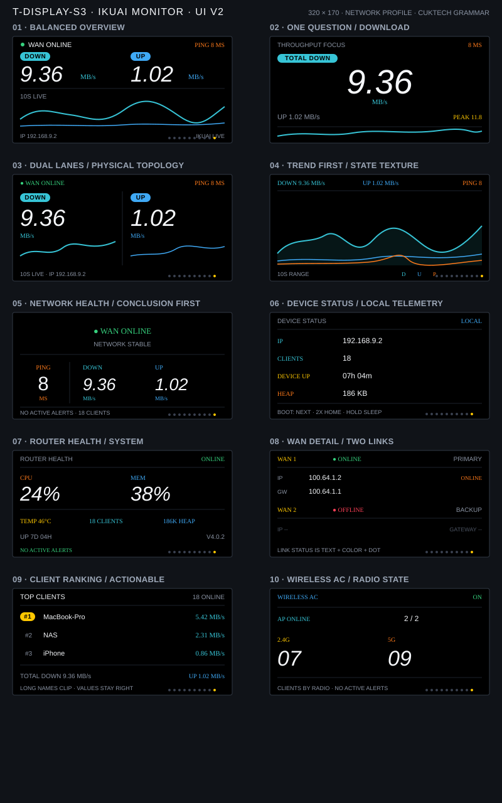

# T-Display-S3 iKuai Network Monitor

This repository contains a focused iKuai router monitor for the LILYGO T-Display-S3. It reads router telemetry over Wi‑Fi and presents WAN status, ping, download/upload rates, clients, and wireless status on the onboard ST7789 display.

The UI is designed as a compact information wall: black background, restrained status colors, large live throughput numbers, and a grid-free rolling trend chart. The first build runs in offline demo mode and does not connect to a network.

## UI preview

The firmware contains ten single-purpose pages. The SVG previews below show the main screen and representative pages 1–8; the complete ten-page design overview is included separately so the README stays readable on GitHub.




## Features

| Page | Content | Source |
| --- | --- | --- |
| 1 | WAN state, ping, download/upload rates, three-track trend | `monitoring/system`, 1 s |
| 2 | Throughput focus view, upload secondary row, session peak | `monitoring/system` |
| 3 | Dual traffic lanes with independent mini-trends | `monitoring/system` |
| 4 | Full-screen rolling trend and ping | `monitoring/system` + ICMP |
| 5 | Network health conclusion, evidence, and alert guidance | `monitoring/system` + local Wi-Fi |
| 6 | Local IP, clients, uptime, and heap | Local state |
| 7 | Router CPU, memory, temperature, uptime, and firmware | `monitoring/system` |
| 8 | Dual-WAN public IP, gateway, and link state | `monitoring/interfaces-status`, every 3 s |
| 9 | Top three clients by download rate, online count, and traffic summary | `monitoring/clients-online`, every 3 s |
| 10 | Wireless AC state, AP count, and 2.4 GHz/5 GHz client counts | AC and wireless endpoints, every 3 s |

Extended endpoints rotate one request every three seconds to keep router load low.

The monitor marks each extended data source independently as live or stale instead of presenting old WAN/client/AC values as current. Realtime throughput uses iKuai's instantaneous `stream.download` and `stream.upload` fields directly; cumulative `total_down` and `total_up` are not differenced into a second rate. The UI formats the direct value as `B/s`, `KB/s`, or `MB/s`, and the ping label is `GW` because it measures the local gateway, not an Internet speed test.

BOOT (GPIO0): single press changes page, double press returns home, and long press toggles the display. The single/double decision window is 260 ms and the active page dot briefly flashes to confirm a key event. Wi-Fi reconnects with exponential backoff (up to 30 s) instead of hammering the access point. The UI returns home after 60 seconds without input.

Day brightness is configurable from 0–100% and defaults to 45% in the tracked template; SNTP-based night dimming defaults to 12% from 23:00–07:00. The home footer changes to `NIGHT DIM` while the scheduled dim level is active.

## Hardware and display driver

- MCU: ESP32-S3R8, 16 MB Flash, 8 MB OPI PSRAM
- Display: ST7789, landscape 320×170, 8-bit i80 parallel bus
- Peripheral power: GPIO15; pull it high before LCD initialization
- LCD data: GPIO39/40/41/42/45/46/47/48
- LCD control: RST GPIO5, CS GPIO6, DC GPIO7, WR GPIO8, backlight GPIO38
- BOOT button: GPIO0

The monitor uses the ESP-IDF `esp_lcd` driver and LVGL 9. The iKuai firmware entry point is `examples/ikuai_widget`; other Arduino/LVGL 8 examples are outside this project's runtime path.

## Build

```bash
cd examples/ikuai_widget
pio run -e t-display-s3
```

The project resolves LVGL 9.2.2 through ESP-IDF Component Manager (`src/idf_component.yml`) and keeps the lock file in `dependencies.lock`. A clean checkout builds in offline demo mode using the tracked example configuration; no private file is required for the first build.

To enable live iKuai monitoring, create local configuration files:

```bash
cp src/config.example.h src/config.h
cp src/ikuai_cert.example.h src/ikuai_cert.h
```

Then:

1. Fill in Wi‑Fi, iKuai host, and Bearer token in `src/config.h`.
2. Set `APP_DEMO_MODE` to `0`.
3. Put the router HTTPS CA certificate in `src/ikuai_cert.h`.
4. Build first, then explicitly run the upload command. Do not commit either local file.

Real credentials, certificates, serial paths, and build outputs are kept out of version control.

## Layout

```text
examples/ikuai_widget/
├── src/main.c                 # Application entry point
├── src/lcd_driver.c           # T-Display-S3 ST7789 i80 driver
├── src/lv_port_disp.c         # LVGL display port
├── src/desktop_widget.c       # Ten-page monitoring UI and motion
├── src/ikuai_monitor.c        # iKuai API, ping, and data cache
├── src/fonts/                 # D-DIN LVGL fonts
├── src/idf_component.yml      # Pinned LVGL 9.2.2 dependency
├── components/lv_conf.h       # Target-sized LVGL feature configuration
├── docs/                      # UI previews used above
└── platformio.ini             # t-display-s3 build entry
```

## Validation boundary

The `t-display-s3` firmware has been built, flashed to a physical board, and exercised on the real iKuai link. Serial evidence includes the 8 MB PSRAM memory test, the LVGL UI task starting on core 1, Wi‑Fi association, and a successful iKuai HTTPS API response. No reboot or UI task crash was observed during the monitored run.

The latest physical check specifically covers startup, live data, page switching, gateway ping startup, the adaptive CPU/MEM `%` suffix alignment, and the 45% day-backlight configuration. The API also now reports categorized failure states for the network-health page. Final visual acceptance of every page still depends on the display angle and a direct screen check; build, serial, and API success are not substitutes for that visual check. Private router credentials and certificates remain local and are not part of this repository.

See [`CHANGELOG.md`](CHANGELOG.md) for the current UI and hardware-validation record.
