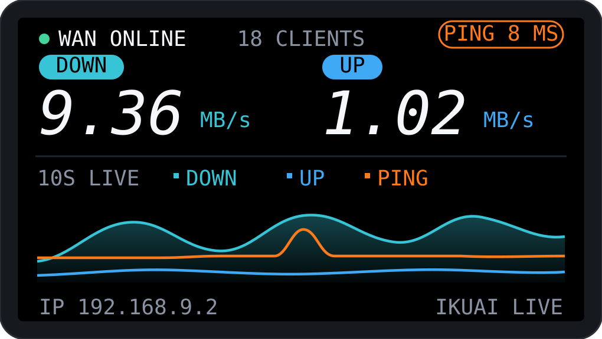
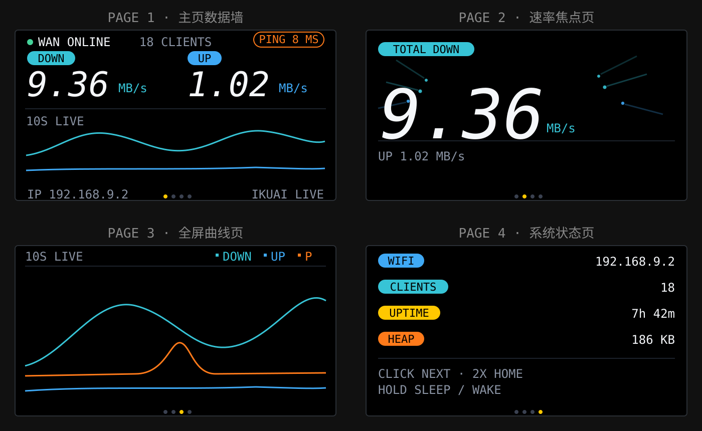
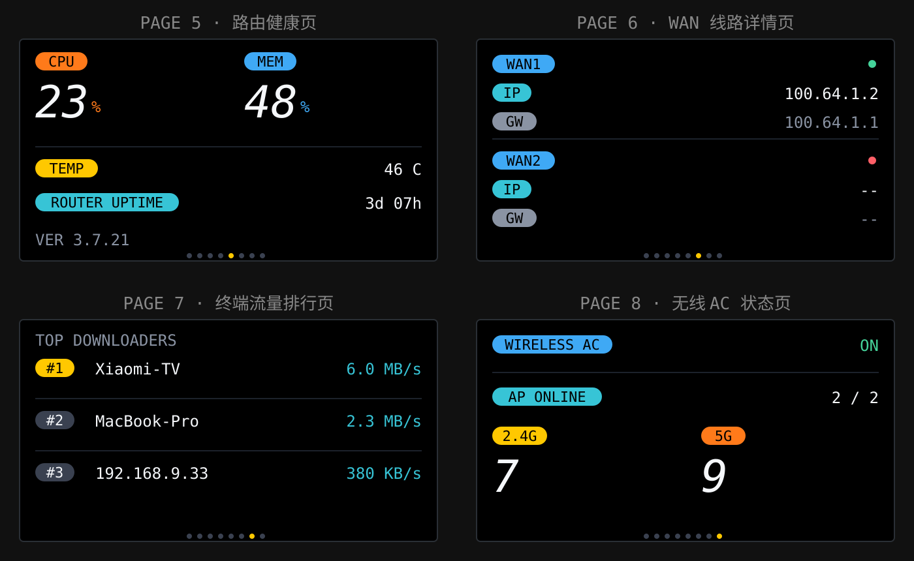

# T-Display-S3 iKuai 网络监控屏 / iKuai Network Monitor

面向 T-Display-S3（非触摸版）的桌面监控摆件固件：LVGL 界面实时显示 iKuai 路由器 WAN 状态、上下行速率与滚动趋势曲线。UI 采用酷态科（CUKTECH）小屏设计语言：纯黑底 + D-DIN Italic 大数字 + 彩色胶囊标签 + 无网格渐变曲线。

本目录是 T-Display-S3 的独立监控固件入口，面向板载 ST7789 屏幕和 GPIO0 BOOT 按键。

## 实际显示画面





## 页面与按键

设备为**八页单键翻页**结构（酷态科"一屏一焦点"原则），底部居中 8 个页码点（黄=当前页）：

| 页 | 内容 | 数据源（iKuai v4.0 API） |
|---|---|---|
| 1 | 主页数据墙：WAN 状态 / PING 胶囊 / 上下行大数字 / 三色趋势曲线 | monitoring/system（1s） |
| 2 | 速率焦点页：2 倍超大总下行速率 + UP 副行 | 同上 |
| 3 | 全屏曲线页：300×108 无网格三色滚动曲线 | 同上 + ICMP ping |
| 4 | 本机状态页：WIFI(IP) / CLIENTS / UPTIME / HEAP 胶囊行 | 本地 |
| 5 | 路由健康页：CPU/内存双大数字 + 温度 + 路由运行时间 + 固件版本 | monitoring/system 附带字段（零额外请求） |
| 6 | WAN 线路详情页：双线路公网 IP / 网关 / 在线状态点 | monitoring/interfaces-status（3s 轮转） |
| 7 | 终端流量排行页：下行 Top3（名称 + 实时速率，第一名黄胶囊） | monitoring/clients-online（3s 轮转） |
| 8 | 无线 AC 状态页：AC 开关 / AP 在线数 / 2.4G·5G 终端大数字 | network/ac/services + monitoring/wireless-statistics（3s 轮转） |

> 扩展端点采用**轮转制**：每 3 秒只发一个额外请求（WAN → 终端 → AC 循环），不给路由器加压力；AC 未开启时第 8 页显示 OFF 且不再请求无线统计。

**BOOT 键（GPIO0）**：单击 = 下一页（350ms 双击窗口内第二次按下 = 直接回主页，循环翻页带 250ms 缓出滑入动画）；长按 1.2s = 息屏/唤醒（背光 0 ↔ 配置值）。消抖 30ms。**60 秒无操作自动回主页**。

## 动态行为（酷态科语言的灵魂细节）

- **静默降灰 / 活跃点亮**：单方向流量 < 48KB/s 时，对应大数字和单位自动降为深灰 `#4A5260`（30号站待机页精神）；有流量即点亮
- **PING 胶囊变色**：正常 = 橙描边；延迟 ≥ 80ms 或超时 = 红色——不看数字先读色
- **下行曲线渐变填充**：30号站同款 sparkline，亮线 + 向下渐淡填充，不覆盖其他轨道
- **焦点页峰值标记**：会话峰值以 `PEAK x.x MB/s *` 黄字常驻（模式 C 规格）
- **翻页方向感动画**：向前翻从右滑入，回翻从左滑入
- **焦点页流星汇入**：流量活跃时，12 颗青/蓝流星带拖尾从两侧向大数字汇聚、到达后消散重生（模式 C 完全体，30fps 粒子画布，流量静默时自动熄灭）
- **夜间自动降背光**：SNTP 授时（ntp.aliyun.com，CST-8）后，23:00–07:00 背光自动降到 `APP_BL_NIGHT_PCT`（默认 8%），时段可在 `config.h` 改；手动息屏优先，时间未同步时不动作

## 硬件

- **主控**：ESP32-S3R8（Wi-Fi / BLE，16MB Flash，8MB OPI PSRAM）
- **屏幕**：ST7789，170×320，**8-bit 并口（i80，非 SPI）**
- **按键**：BOOT（GPIO0），单键完成翻页、回主页和息屏/唤醒

## ⚠ 重点注意事项（移植/烧录前必读）

1. **GPIO15 是外设总电源**：必须在初始化最前面置高，否则 LCD、背光全部不工作。已在 `lcd_init()` 首步处理，改动启动流程时不要删掉。
2. **屏幕是并口不是 SPI**：D0-D7 = GPIO 39/40/41/42/45/46/47/48，WR=8、DC=7、CS=6、RST=5、BL=38。驱动基于 `esp_lcd` i80，与 SPI 驱动不通用。
3. **sdkconfig 必须匹配**：Flash 16MB QIO 80MHz、PSRAM **OPI** 80MHz。已提供 `sdkconfig.defaults`，首次构建会自动生效；若用旧 sdkconfig 构建请先删除再重建。
4. **外部供电（非 USB-C）时必须禁用 USB CDC**，否则开机等待串口连接、程序不启动：取消 `platformio.ini` 中 `build_flags` 注释即可。
5. **烧录失败时手动进下载模式**：按住 BOOT → 按一下 RST → 松开 RST → 松开 BOOT，然后重新 upload。
6. **分辨率**：屏幕按横屏 320×170 适配（底部信息行紧贴下边缘，改布局时注意）。
7. **状态不依赖额外外设**：本固件只使用屏幕和 BOOT 键；在线状态由屏幕状态点与文案显示。

## 功能

- **LVGL 监控面板**（横屏 320×170，背光上限 40%）：WAN 在线状态、在线设备数、网关 PING（橙色描边胶囊）、下行/上行实时速率大数字（D-DIN Italic，青/蓝胶囊标签）、约 10 秒三色滚动趋势曲线（30fps，临界阻尼平滑）
- **iKuai 路由器数据源**：HTTPS + Bearer token + 固定证书，1 秒轮询
- **离线演示模式**：`APP_DEMO_MODE=1` 时使用模拟数据运行

## 构建 / Build

```bash
# 干净检出即可先编译离线演示，不连接 Wi-Fi/iKuai
pio run -e t-display-s3

# 连接真实 iKuai 时再创建以下本地文件，并填写配置/证书
cp src/config.example.h src/config.h
cp src/ikuai_cert.example.h src/ikuai_cert.h
pio run -e t-display-s3       # 编译
pio run -e t-display-s3 -t upload
pio device monitor
```

LVGL 9.2.2 由 `src/idf_component.yml` 管理，版本锁定在 `dependencies.lock`；`components/lv_conf.h` 是本板的精简配置。`src/config.h`、`src/ikuai_cert.h`、构建目录和生成的 `sdkconfig` 均为本地文件，不要提交。

## Build / English

Run `pio run -e t-display-s3` from a clean checkout to build the offline demo. The demo uses the tracked example configuration and makes no network connection. For live iKuai monitoring, copy both example headers to `src/config.h` and `src/ikuai_cert.h`, fill in Wi‑Fi/router settings and the CA certificate, then set `APP_DEMO_MODE` to `0` before building and uploading.

LVGL 9.2.2 is managed by `src/idf_component.yml` and pinned in `dependencies.lock`. The board-specific trimmed feature set lives in `components/lv_conf.h`. Local credentials, certificates, build output, and generated `sdkconfig` files are intentionally excluded from Git.

## 目录结构

```
src/
├── main.c                # 入口
├── desktop_widget.c/h    # LVGL 监控面板界面（酷态科设计语言）
├── ikuai_monitor.c/h     # iKuai 路由器监控
├── lcd_driver.c/h        # ST7789 i80 并口驱动（esp_lcd）
├── lv_port_disp.c/h      # LVGL 显示移植层
└── fonts/                # D-DIN / D-DIN Italic LVGL 字体
```
